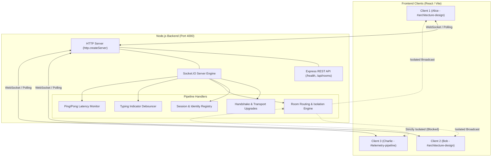

# DevCraft Precision — Real-Time WebSocket Data Pipeline

> **Sprint 12 Track B: Fullstack Development**  
> A high-performance, real-time bidirectional data pipeline built with Node.js, Express, Socket.IO v4, and React (Vite). Designed for sub-millisecond event streaming, room isolation, active presence tracking, and live telemetry monitoring.

---

## 🌐 Live Deployment

- **Live Application URL**: [Insert Live Deployment URL Here]
- **Backend API & Health Telemetry**: `[Insert Backend URL Here]/health`

---

## 📸 Key Features

- **⚡ Bidirectional Real-Time Communication**: Built on Socket.IO v4 with native WebSocket transport and automatic polling fallback.
- **🛰️ Live Telemetry Rail**: Real-time Round-Trip Time (RTT) latency tracking via periodic heartbeat ping/pong cycles, transport monitoring (`websocket` / `polling`), and connection uptime.
- **🔒 Isolated Room Architecture**: Dedicated communication channels (`#architecture-design`, `#telemetry-pipeline`, `#general-engineering`) with strict payload isolation preventing cross-channel data leaks.
- **👥 Dynamic Presence & Session State**: Custom user avatars, roles, usernames, and live participant lists dynamically broadcast to room members on join, leave, or disconnect.
- **✍️ Real-Time Typing Indicators**: Keystroke debouncing with auto-clearing timeout safeguards (auto-reset on abrupt disconnect or idle).
- **📜 Buffered Message History**: In-memory ring buffer preserving up to 100 recent messages per room alongside system announcements for joins/leaves.
- **🔄 Fault-Tolerant Reconnection**: Automatic reconnection strategies with exponential backoff and persistent local session recovery.
- **📊 REST Telemetry & Health APIs**: Integrated Express endpoints (`/health` and `/api/rooms`) exposing active socket counts, room statistics, and process uptime.

---

## 🛠️ Tech Stack

### Backend
- **Runtime**: [Node.js](https://nodejs.org/) (ES Modules)
- **Framework**: [Express 4](https://expressjs.com/)
- **WebSocket Engine**: [Socket.IO 4](https://socket.io/)
- **Cross-Origin Handling**: `cors`
- **Environment Management**: `dotenv`

### Frontend
- **Framework**: [React 18](https://react.dev/)
- **Build Tool**: [Vite 6](https://vitejs.dev/)
- **WebSocket Client**: `socket.io-client 4`
- **Styling**: Vanilla CSS (Custom DevCraft Precision Dark Theme & Glassmorphism Design System)

### Testing & Verification
- Multi-client automated test harness utilizing Node.js native `assert` and `socket.io-client`.

---

## 🏗️ Architecture & Data Flow



---

## 📁 Repository Structure

```text
Sprint12/
├── package.json              # Root scripts orchestrating client and server
├── README.md                 # Project documentation
├── server/                   # Node.js + Express + Socket.IO Backend
│   ├── package.json          # Backend dependencies and scripts
│   ├── src/
│   │   └── server.js         # HTTP server, REST endpoints, and Socket.IO pipeline
│   └── tests/
│       └── test-pipeline.js  # Automated multi-client test harness
└── client/                   # React + Vite Frontend
    ├── package.json          # Frontend dependencies and scripts
    ├── vite.config.js        # Vite build and dev server config
    ├── index.html            # HTML entry point
    └── src/
        ├── App.jsx           # Main workbench layout shell
        ├── main.jsx          # React DOM root entry
        ├── index.css         # DevCraft Precision design system styles
        ├── hooks/
        │   └── useSocket.js  # Core custom hook managing WebSocket lifecycle
        └── components/
            ├── Header.jsx           # Top telemetry bar, status pills & profile
            ├── ChannelSidebar.jsx   # Room navigation and channel switcher
            ├── ChatViewport.jsx     # Message flow & chat area
            ├── MessageList.jsx      # Message list renderer with system notices
            ├── MessageInput.jsx     # Input field, send button, keystroke emitter
            ├── TypingIndicator.jsx  # Typing animation indicators
            ├── TelemetryRail.jsx    # Right rail showing room participants & RTT
            └── SessionModal.jsx     # Profile customization modal (name, avatar, role)
```

---

## 🔌 WebSocket Protocol Reference

### Client-to-Server Events

| Event Name | Payload | Description |
| :--- | :--- | :--- |
| `session:register` | `{ username, avatar, role, customColor }` | Registers or updates user profile metadata. |
| `room:join` | `{ roomId }` | Subscribes socket to a channel and loads message history. |
| `room:leave` | `{ roomId }` | Unsubscribes socket from the active channel. |
| `message:send` | `{ roomId, text }` | Sends a chat message payload to be broadcast to room. |
| `typing:start` | `{ roomId }` | Alerts the room that the user has started typing. |
| `typing:stop` | `{ roomId }` | Clears user typing status immediately. |
| `latency:ping` | `timestamp` (number) | Latency benchmark probe for RTT telemetry calculation. |

### Server-to-Client Events

| Event Name | Payload | Description |
| :--- | :--- | :--- |
| `connection:ack` | `{ socketId, serverTime, transport, availableRooms, session }` | Emitted upon initial handshake with server info. |
| `session:updated` | `session` (object) | Confirms sanitized user profile information. |
| `room:history` | `{ roomId, messages }` | Delivers buffered message history upon entering a room. |
| `room:users` | `{ roomId, users, count }` | Broadcasts active participant list for the room. |
| `message:broadcast` | `{ id, type, text, roomId, timestamp, sender }` | Broadcasts user or system message to room members. |
| `typing:update` | `{ roomId, typingUsers }` | Broadcasts list of currently typing users in the room. |
| `latency:pong` | `{ clientTimestamp, serverTime }` | Responds to ping probe to calculate millisecond latency. |

---

## 🚀 Getting Started

### Prerequisites
- **Node.js**: `v18.0.0` or higher
- **npm**: `v9.0.0` or higher

---

### Installation

Clone the repository and install dependencies:

```bash
# 1. Clone the repository
git clone <repository-url>
cd Sprint12

# 2. Install server dependencies
cd server
npm install

# 3. Install client dependencies
cd ../client
npm install

# 4. Return to root
cd ..
```

---

### Running the Application

You will need two terminal windows:

#### Terminal 1: Start Backend Server
```bash
npm run dev:server
```
- Starts the Node.js + Socket.IO server at **`http://localhost:4000`**.
- Features automatic file watching via `node --watch`.

#### Terminal 2: Start Frontend Client
```bash
npm run dev:client
```
- Starts Vite development server at **`http://localhost:5173`**.
- Open your browser at `http://localhost:5173`.

---

### Verifying Multi-User Real-Time Functionality

1. Open `http://localhost:5173` in **two separate browser windows** (or one standard tab and one Incognito tab).
2. Set up identity profiles in both tabs (e.g. `Dev_Alice` and `Dev_Bob`).
3. Select the same room (e.g., `#architecture-design`).
4. **Observe Real-Time Behavior:**
   - Active presence counts update immediately on both screens.
   - Typing in Window 1 immediately displays `<user> is typing...` in Window 2.
   - Messages sent from Window 1 appear instantly in Window 2.
   - Switch Window 2 to `#telemetry-pipeline` and verify that messages sent in `#architecture-design` do not leak.

---

## 🧪 Automated Testing

An end-to-end multi-client verification script tests handshake completion, session registration, room subscription, typing indicators, isolated broadcasting, and heartbeat latency:

```bash
# Ensure backend server is running in another terminal
npm run test:server
```

**Verification output:**
```text
--- STARTING WEBSOCKET PIPELINE MULTI-CLIENT VERIFICATION ---

1. Verifying Client Handshakes (Phase 1)...
✔ Handshake verified for 3 clients: [ID-1, ID-2, ID-3]

2. Verifying Session Identification (Phase 2)...
✔ Session registration verified for Alice, Bob, and Charlie

3. Joining Rooms (Phase 3)...
✔ Client 1 and Client 2 subscribed to #architecture-design; Client 3 subscribed to #telemetry-pipeline

4. Verifying Real-Time Typing Indicator (Phase 2)...
✔ Client 2 received typing indicator from Alice_Dev in #architecture-design

5. Verifying Strict Room Isolation & Broadcast (Phase 1 & 3)...
✔ Client 2 in #architecture-design successfully intercepted payload from Alice_Dev
✔ STRICT ISOLATION CONFIRMED: Client 3 in #telemetry-pipeline did NOT receive payload from #architecture-design

6. Verifying Heartbeat / Latency Ping-Pong...
✔ Latency Pong received in 2ms

🎉 ALL FULLSTACK WS PIPELINE PHASES FULLY VALIDATED! 🎉
```

---

## 🌐 REST Endpoints

| Method | Endpoint | Description | Sample Output |
| :--- | :--- | :--- | :--- |
| `GET` | `/health` | Server uptime, active sockets, and room status | `{"status":"online","uptimeSeconds":120,"activeSockets":2,...}` |
| `GET` | `/api/rooms` | List of available rooms and metadata | `[{"id":"architecture-design","name":"architecture-design",...}]` |

---

## 🚢 Deployment Guide

### Deploying the Backend (e.g., Render / Railway / Fly.io)
1. Set the root directory to `server`.
2. Build command: `npm install`
3. Start command: `node src/server.js`
4. Set environment variable: `PORT=4000` (or allow platform-assigned port).
5. Ensure WebSocket support is enabled in your host configuration.

### Deploying the Frontend (e.g., Vercel / Netlify / Cloudflare Pages)
1. Set root directory to `client`.
2. Build command: `npm run build`
3. Output directory: `dist`
4. In `client/src/hooks/useSocket.js`, update `SOCKET_SERVER_URL` or configure an environment variable (`import.meta.env.VITE_SERVER_URL`) pointing to your deployed backend URL.

---

## 📜 License

MIT License — free for educational and production use.
